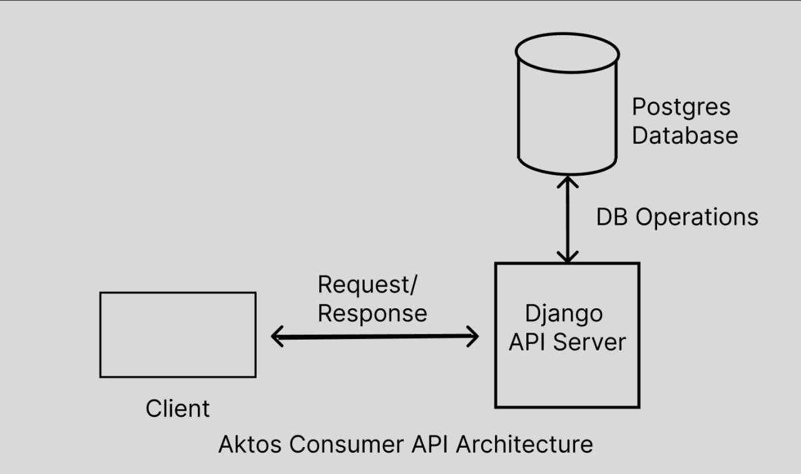

# Project Documentation

## Summary Description

The project is a Django-based web application that provides an API endpoint for managing consumer data. The API allows users to filter the set of consumers based on various parameters such as the number of previous jobs held and the status of debt collection. The consumer data is stored in a Postgres database, and the API provides listing and filtering functionality. The project includes a custom command for loading consumer data from a CSV file into the database. The API responses are in GeoJSON format, representing a collection of consumer features.

## Note:

- The project is served in a multi-stage docker setup. GDAL and Geos dependencies are bulky and have been included in
  an intermediary dockerfile hosted on Dockerhub (lusimba/gdal-gis-intermediary:latest). It is used to build the final image
  that runs the aktos consumer app.
- The API is browsable using Django Rest Framework web view

## Installation

1. clone this repository (git clone git@github.com:Lusimba/aktos.git).
2. Open a terminal or command prompt and navigate to the project's root directory (`aktos`).
3. Rename the Caddyfile_local to `Caddyfile`
4. Run `$ make build` to build the project

## Loading Data

5. Run `$ make load-data` to load data from the csv file

## API Access

1. Go to `http://aktos.localhost/consumers` to view the browsable API

### API Endpoints

The project provides the following API endpoints:

- **GET /consumers** - Retrieve a list of consumers based on optional query parameters:
- `min_previous_jobs_count`: The minimum number of previous jobs held.
- `max_previous_jobs_count`: The maximum number of previous jobs held.
- `previous_jobs_count`: The exact number of previous jobs held.
- `status`: The status of debt collection.

- `No arguments`: localhost:8000/consumers
- `With arguments`:
- `min_previous_jobs_count=2`: localhost:8000/consumers?min_previous_jobs_count=2
- `max_previous_jobs_count=3`: localhost:8000/consumers?max_previous_jobs_count=3
- `previous_jobs_count=4`: localhost:8000/consumers?previous_jobs_count=4
- `status=active: localhost`:8000/consumers?status=active
- `Multiple arguments`: localhost:8000/consumers?min_previous_jobs_count=2&max_previous_jobs_count=3&status=active
- `Consumer detail view (ConsumerDetailView)`: localhost:8000/consumers/<pk>

## Testing

To run the project's tests, use the following command:

1. Run `$ make test` to run the tests

## Rate Limiter

To test the rate limiter, check check `aktos/middleware/middlewares.py` and alter `request_count` to trigger the `HttpResponseForbidden('Rate limit exceeded')` condition.

## Improvements for Production Standards

The following aspects have not been implemented for the sake of portability of this project. However, they would improve
the quality of the project to production standards:

1. **Security**: Implement authentication and authorization mechanisms to secure the API endpoints. Use SSL/TLS (HTTPS) for secure communication.

2. **Environment Configuration**: Use environment variables to store sensitive settings such as database credentials and secret keys. This helps to separate configuration from code and improves security. Docker secrets would help to isolate sensitive information from
   code.

3. **Task Queue**: Consider using a task queue system (e.g., Celery) for handling background processing and long-running tasks asynchronously. This helps offload resource-intensive operations from the main web application.

4. **Logging**: Implement a comprehensive logging strategy to record important events and errors. Configure log rotation and storage of logs in a central location for easy monitoring and troubleshooting.

5. **Caching**: Utilize caching mechanisms (e.g., Redis) to improve the performance of frequently accessed data. Caching can reduce the load on the database and improve response times.

6. **API Documentation**: Generate and maintain comprehensive API documentation using tools like Swagger or Django REST Swagger. This helps developers and consumers of the API understand its capabilities and usage.

7. **Deployment**: Use a robust deployment process that includes automation, continuous integration, and containerization (e.g., Docker) to ensure consistent and reliable deployments.

8. **Monitoring and Alerting**: Implement monitoring and alerting solutions to track the health and performance of the application. Use tools like Prometheus, Grafana, or Sentry to detect and respond to issues proactively.

9. **Scaling**: Consider horizontal scaling options (e.g., load balancing, auto-scaling) to handle increased traffic and ensure high availability of the application.

10. **Error Handling and Validation**: Implement comprehensive error handling and validation mechanisms to provide meaningful error messages and ensure data integrity.
